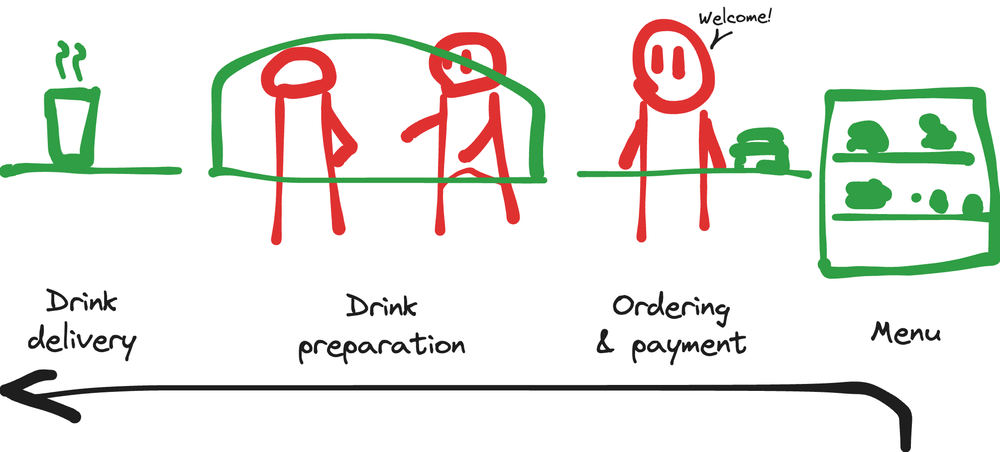
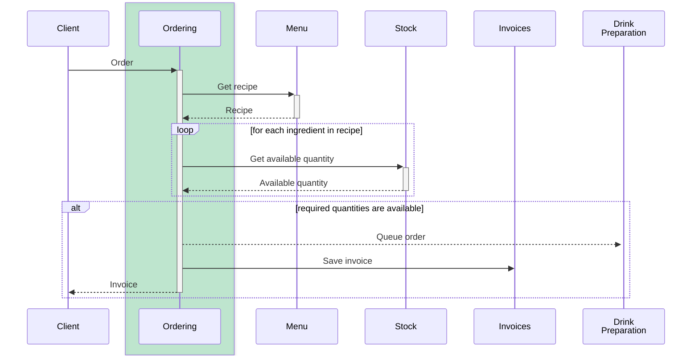

# Supple Design sandbox

 

## Usage

*Note: This project depends on a personal GitHub Package Registry. In order to build locally, it is necessary to set
USERNAME and TOKEN environment variables. Instructions for the generation of a token are available in
[Creating a personal access token](https://docs.github.com/en/authentication/keeping-your-account-and-data-secure/creating-a-personal-access-token).*

Run tests: `./gradlew test`

## Context

### User journey

<picture>
  <source media="(prefers-color-scheme: dark)" srcset="doc/images/context_dark.png" />
  
</picture>

### Interfaces

<picture>
  <source media="(prefers-color-scheme: dark)" srcset="doc/images/interfaces_dark.svg" />
  
</picture>

### Business logic

### Considered evolutions

 * Do not check availability of ingredients
 * Consider all ingredients as available in case Stock service is down
 * Check customer account for possible discounts
 * Make preparation step blocking
